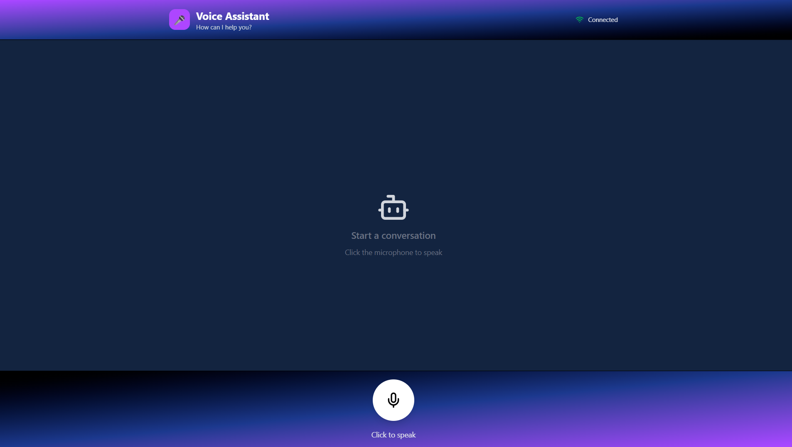
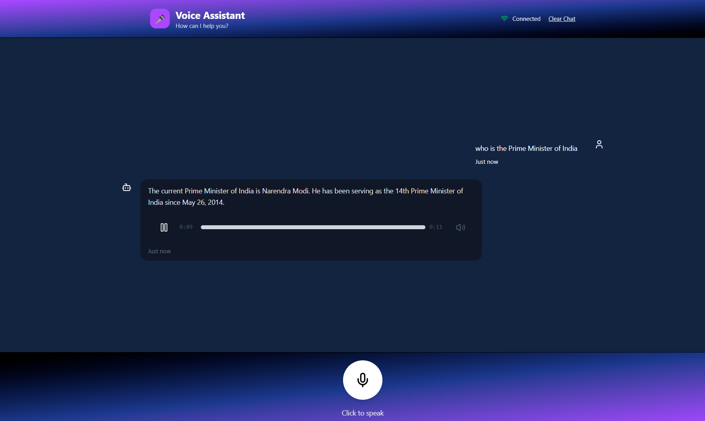
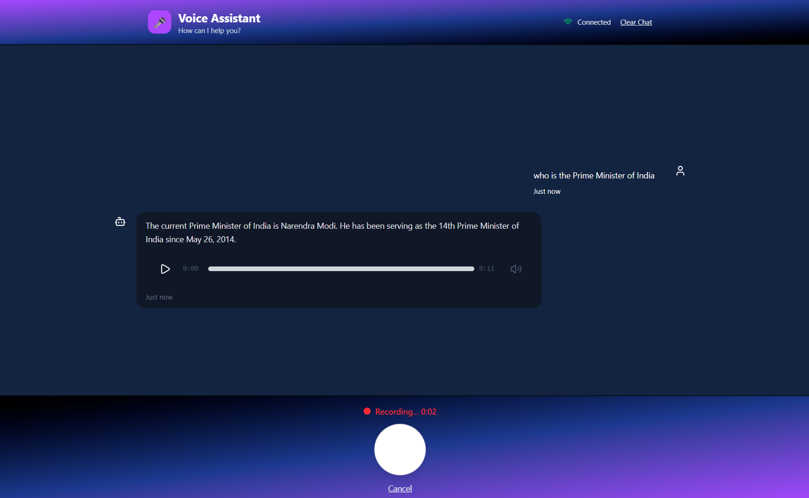

# 🎤 Voice Assistant - AI-Powered Conversational Bot

A real-time voice-to-voice AI assistant built with React, Flask, and Groq AI. Speak naturally and get intelligent responses with text-to-speech output.

   

---

## Watch Video

[Working Demo](https://drive.google.com/file/d/10e-nXFV0cQwUoAZ89yh6xLPcD3PWWmgf/view?usp=sharing)

## ✨ Features

- 🎤 **Voice Input** - Real-time microphone recording with visual feedback
- 🤖 **AI Responses** - Powered by Groq's LLaMA 3.3 70B model
- 🔊 **Text-to-Speech** - AI responses converted to natural-sounding audio
- 💬 **Chat History** - Beautiful conversation interface with timestamps
- 🎵 **Audio Playback** - Play/pause AI responses with progress bar
- 🔌 **Connection Status** - Real-time backend health monitoring
- 🎨 **Modern UI** - Gradient backgrounds with Tailwind CSS animations
- 📱 **Responsive Design** - Works on desktop and mobile browsers

---

## 📸 Screenshots

### Screen



### Chat Display



### Recording



## 🏗️ Tech Stack

### Frontend

- **React 19.2** - UI framework
- **Vite** - Build tool and dev server
- **Tailwind CSS 4.1** - Styling
- **Axios** - HTTP client for API calls
- **Lucide React** - Beautiful icons
- **MediaRecorder API** - Browser audio recording

### Backend

- **Python 3.8+** - Programming language
- **Flask 3.0** - Web framework
- **Flask-CORS** - Cross-origin resource sharing
- **Groq AI** - Large language model (LLaMA 3.3 70B)
- **Google Speech Recognition** - Speech-to-text conversion
- **gTTS** - Google Text-to-Speech
- **PyDub** - Audio processing

### API Keys

- **Groq API Key** - [Get free key](https://console.groq.com/keys)

---

## 🚀 Installation

### 1. Clone Repository

```bash
git clone https://github.com/Aasthayuli/Voice_Assistant_with_Groq_API
```

### 2. Backend Setup

```bash
# Navigate to backend folder
cd Backend

# Create virtual environment
python -m venv venv

# Activate virtual environment
# Windows:
venv/Scripts/activate
# Mac/Linux:
source venv/bin/activate

# Install dependencies
pip install -r requirements.txt

# Create .env file
copy .env.example .env  # Windows
# or
cp .env.example .env    # Mac/Linux

# Add your Groq API key to .env
# GROQ_API_KEY=your_api_key_here
```

### 3. Frontend Setup

```bash
# Navigate to frontend folder
cd ../Frontend

# Install dependencies
npm install
```

---

## ⚙️ Configuration

### Backend Configuration (`backend/.env`)

```env
# Groq API Configuration
GROQ_API_KEY=your_groq_api_key_here

# Flask Configuration
FLASK_ENV=development
FLASK_DEBUG=True
FLASK_APP=app.py

# Server Configuration
HOST=0.0.0.0
PORT=5000

# Audio Configuration
MAX_AUDIO_SIZE=10485760  # 10MB
ALLOWED_AUDIO_FORMATS=wav,mp3,webm,ogg,m4a
MAX_AUDIO_DURATION=60  # seconds

# CORS Settings
CORS_ORIGINS=http://localhost:5173
```

### Frontend Configuration

The frontend automatically connects to `http://localhost:5000` for the backend API.

To change this, update `frontend/src/services/api.js`:

```javascript
const API_BASE_URL = "http://localhost:5000";
```

---

## 🎮 Running the Application

### Start Backend Server

```bash
cd backend
python app.py
```

### Start Frontend Dev Server

```bash
cd frontend
npm run dev
```

### Access Application

Open your browser and navigate to:

```
http://localhost:5173
```

---

## 📱 Usage

1. **Allow Microphone Access** - Browser will prompt for permission
2. **Select Correct Microphone** - Ensure your desired input device is selected in browser settings
3. **Click Microphone Button** - Start speaking
4. **Click Again to Stop** - Audio will be processed
5. **Listen to Response** - AI response plays automatically
6. **View Chat History** - All conversations are displayed

### Microphone Selection

**Windows:**

1. Settings -> System -> Sound -> Input
2. Select your preferred microphone
3. Test by speaking (bars should move)
4. Refresh browser

**Browser Settings:**

1. Settings -> site settings -> Microphone
2. Select correct device

---

## 🔧 API Endpoints

### Backend API Routes

| Method | Endpoint             | Description                                     |
| ------ | -------------------- | ----------------------------------------------- |
| GET    | `/`                  | API information                                 |
| GET    | `/api/health`        | Health check- check Groq Connection             |
| POST   | `/api/process_voice` | Process voice recording & serves audio file url |
| POST   | `/api/cleanup`       | Cleanup old audio files                         |

---

## 🐛 Troubleshooting

### "Could not understand audio"

**Causes:**

- Microphone not selected correctly
- Low recording volume
- Background noise
- Wrong audio input device

**Solutions:**

1. Check microphone selection in browser and system settings
2. Speak clearly and closer to microphone
3. Increase microphone volume in system settings
4. Use Bluetooth or external microphone
5. Test mic in system settings first

### "Cannot connect to server"

**Solutions:**

1. Ensure backend is running on port 5000
2. Check if `python app.py` shows success messages
3. Verify firewall isn't blocking port 5000
4. Check CORS settings in `backend/.env`

### "Groq API connection failed"

**Solutions:**

1. Verify API key in `backend/.env`
2. Check internet connection
3. Visit [Groq Console](https://console.groq.com) to verify API key is valid
4. Check API rate limits

### Files not saving in uploads folder

**Solutions:**

1. Check folder permissions
2. Verify folders exist: `backend/static/audio/uploads/`

---

## 🎯 Features Roadmap

- Audio files deletes from server as clear button is clicked
- Wake word detection ("Hey Assistant")
- Voice activity detection (VAD)
- Real-time streaming responses

---

## 📄 License

This project is licensed under the MIT License - see the [LICENSE](LICENSE) file for details.

---

## 🙏 Acknowledgments

- [Groq](https://groq.com) - Fast AI inference
- [Google Speech Recognition](https://cloud.google.com/speech-to-text) - Speech-to-text
- [gTTS](https://github.com/pndurette/gTTS) - Text-to-speech
- [React](https://react.dev) - UI framework
- [Flask](https://flask.palletsprojects.com) - Backend framework
- [Tailwind CSS](https://tailwindcss.com) - Styling

---

## 📧 Contact

**Aasthayuli** - aasthayuli2025@gmail.com

---

## 🌟 Star History

If you find this project helpful, please consider giving it a ⭐ star on GitHub!

---

**Built with ❤️ using React, Flask, and Groq AI**
